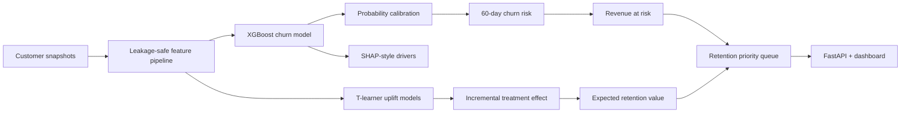

# Customer Retention Intelligence

Portfolio-grade **B2B SaaS churn + retention decision system** by Technyder.

This project goes beyond a basic churn classifier and answers four business questions:

1. Who is likely to churn in the next 60 days?
2. Why is the model flagging them?
3. How much recurring revenue is at risk?
4. Which customers are actually worth targeting with a retention action?

> The project uses fully synthetic customer data. No real customer or personal data is included.

## What makes it production-oriented

- Time-based train / validation / test split
- XGBoost champion vs logistic-regression baseline
- Platt probability calibration
- Economic threshold optimization
- TreeSHAP-style model contribution explanations
- Revenue-at-risk scoring
- T-learner uplift modeling for treatment targeting
- Expected retention value priority queue
- FastAPI scoring and batch scoring
- Stakeholder dashboard
- Drift report using PSI
- Docker packaging
- GitHub Actions CI
- Vercel-ready Python deployment
- Model governance and causal-use caveats

## Architecture



## Current synthetic benchmark

- 24,000 customer snapshots
- Overall churn rate: ~6.45%
- Future time holdout: Apr-Jun 2026
- ROC-AUC: ~0.796
- PR-AUC: ~0.331
- Probability calibration with Platt scaling
- Economic decision threshold optimized on validation data

## Local run

```bash
python -m venv .venv
source .venv/bin/activate
pip install -r requirements-dev.txt
python build.py
pytest
uvicorn app:app --reload
```

Open `http://localhost:8000`. API docs: `/docs`.

## API

- `GET /health`
- `GET /api/model-card`
- `GET /api/feature-importance`
- `GET /api/drift`
- `GET /api/portfolio?limit=20`
- `POST /api/score`
- `POST /api/batch-score`

## Production extension

Replace the synthetic generator with a warehouse feature job from Snowflake, BigQuery, Postgres or a CRM. Persist risk/uplift scores back to the warehouse/CRM, schedule rescoring, and monitor drift, calibration and incremental retained revenue.

The business positioning is intentionally:

> **Prioritize the customers where retention effort is most likely to protect recurring revenue.**
