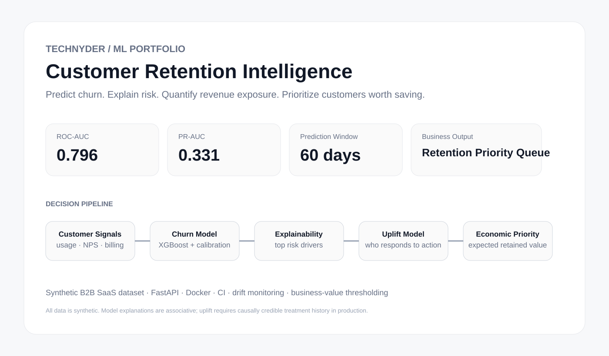
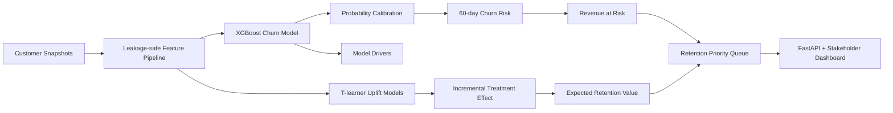

# Customer Retention Intelligence



**Production-style B2B SaaS churn + retention decision system by Technyder.**

**Live demo:** https://retention-intelligence-technyder-incs-projects.vercel.app  
**GitHub project:** https://github.com/Technyder-Inc/Technyder-Inc/tree/main/portfolio/customer-retention-intelligence

This project goes beyond a basic churn classifier. It is designed to answer the four questions a retention team actually cares about:

1. **Who is likely to churn in the next 60 days?**
2. **Why is the model flagging them?**
3. **How much recurring revenue is at risk?**
4. **Which customers are actually worth targeting with a retention action?**

> All customer data in this project is synthetic. No real customer or personal data is included.

---

## Product output

For each account, the system can return:

- Calibrated churn probability
- Risk band
- Annual recurring revenue at risk
- Top model drivers
- Estimated retention uplift
- Expected retention value
- Recommended action flag

This turns churn modeling into a **retention prioritization system**, rather than a notebook that only reports accuracy.

## Why this project is different

A normal churn demo stops at classification accuracy.

This project adds the pieces required for real decision-making:

- **Future time holdout** instead of random train/test leakage
- **XGBoost champion model**
- **Platt probability calibration**
- **Economic threshold optimization**
- **Model contribution explainability**
- **Revenue-at-risk scoring**
- **T-learner uplift modeling**
- **Expected retention value**
- **Retention priority queue**
- **FastAPI real-time and batch scoring**
- **Stakeholder dashboard**
- **PSI feature-drift monitoring**
- **Model governance notes**
- **Docker packaging**
- **GitHub Actions CI**
- **Vercel-ready deployment**

## Architecture



## Synthetic business dataset

The included generator creates a realistic B2B SaaS retention dataset with **24,000 customer snapshots** and features such as:

- Plan tier
- Region and acquisition channel
- Tenure
- Seats
- Monthly recurring revenue
- Product usage
- 90-day usage trend
- Support tickets
- NPS
- Payment failures
- Days since last login
- Feature adoption
- Integrations
- Admin activity
- Renewal proximity
- Contract term
- Recent price increase
- Historical retention treatment
- Future churn outcome

The generator intentionally includes interactions between behavior, renewal timing, billing friction and account maturity so the modeling problem is not trivially separable.

## Current benchmark

| Metric | Result |
|---|---:|
| Dataset | 24,000 synthetic snapshots |
| Churn rate | ~6.45% |
| Future test period | Apr-Jun 2026 |
| ROC-AUC | ~0.796 |
| PR-AUC | ~0.331 |
| Probability calibration | Platt scaling |
| Decision threshold | Economically optimized |

The benchmark is intentionally evaluated on a **future calendar holdout**, which better reflects how churn models are used after deployment.

## Modeling strategy

### 1. Churn prediction
XGBoost predicts the probability that an account will churn within the next 60 days.

### 2. Calibration
Raw model probabilities are calibrated so a score such as `0.70` behaves more like an interpretable probability rather than only a ranking score.

### 3. Explainability
The API returns the strongest model contributions for every scored customer so success teams can understand what pushed risk upward or downward.

### 4. Revenue at risk

```
Annual Revenue at Risk
= Churn Probability × Monthly Revenue × 12
```

This lets the business distinguish a highly risky small account from a moderately risky enterprise account.

### 5. Uplift modeling
Two treatment-response models estimate whether a customer is more likely to remain if a retention intervention is applied.

The key distinction is:

> A customer can have high churn risk but still be a poor retention target if the intervention is unlikely to change the outcome.

### 6. Economic prioritization

```
Expected Retention Value
= Estimated Uplift × Annual Revenue × Retention Margin
  - Intervention Cost
```

Accounts with positive expected value can then be ranked into a retention action queue.

## API

Interactive API documentation is available at:

**Live API docs:** https://retention-intelligence-technyder-incs-projects.vercel.app/docs

Endpoints:

- `GET /health`
- `GET /api/model-card`
- `GET /api/feature-importance`
- `GET /api/drift`
- `GET /api/portfolio?limit=20`
- `POST /api/score`
- `POST /api/batch-score`

Example scoring response:

```json
{
  "churn_probability": 0.61,
  "risk_band": "High",
  "annual_revenue_at_risk": 13176,
  "estimated_uplift": 0.14,
  "expected_retention_value": 2132,
  "recommended_action": true,
  "top_drivers": [
    {
      "feature": "usage_change_90d",
      "direction": "raises risk"
    }
  ]
}
```

## Run the deployed inference stack locally

The checked-in portable model is enough to run the product API. The heavy ML libraries are **not** required for inference.

```bash
python -m venv .venv
source .venv/bin/activate
pip install -r requirements.txt
pip install uvicorn==0.40.0
uvicorn app:app --reload
```

## Reproduce training + portable export

Use the development/training environment only when you want to regenerate the synthetic data, retrain XGBoost and uplift models, and rebuild the portable serverless artifact.

```bash
pip install -r requirements-dev.txt
python build.py
pytest
```

`build.py` trains the full model stack and then exports a compressed pure-Python inference artifact to `artifacts/runtime_model.b64`.

Open:

- Dashboard: `http://localhost:8000`
- API docs: `http://localhost:8000/docs`
- Health: `http://localhost:8000/health`

## Serverless deployment architecture

The training environment and inference environment are deliberately separated.

| Layer | Runtime |
|---|---|
| Training | pandas + NumPy + scikit-learn + XGBoost |
| Portable export | compressed tree/preprocessing/calibration/uplift state |
| Vercel inference | FastAPI + Python standard library |
| Model artifact | ~156 KB compressed Base64 |
| Build-time training on Vercel | **disabled** |

This avoids bundling the full ML toolchain into a serverless function. The portable tree evaluator was checked against the native XGBoost pipeline and reproduces tested churn probabilities to approximately `1e-7` precision.

Vercel should use this folder as the project root when connecting the monorepo:

```
portfolio/customer-retention-intelligence
```

The included `.vercelignore` also excludes training-only code and artifacts from the deployment bundle.

## Docker

```bash
docker build -t retention-intelligence .
docker run -p 8000:8000 retention-intelligence
```

## Repository structure

```
customer-retention-intelligence/
├── app.py
├── build.py
├── ml/
│   ├── generate_data.py
│   └── train.py
├── public/
│   └── index.html
├── assets/
│   └── retention-intelligence-overview.svg
├── tests/
│   └── test_api.py
├── docs/
│   └── model-governance.md
├── Dockerfile
├── vercel.json
├── requirements.txt
├── requirements-dev.txt
└── .github/workflows/ci.yml
```

## Employee CSV / Excel attrition analyzer

The deployed demo also includes a separate workforce-retention page:

**Employee analyzer:** `/employees`

It accepts **CSV or Excel (.xlsx)** employee snapshots and returns:

- Unique employees and active headcount
- Observed employee churn rate when `left_company` is supplied
- Predicted aggregate attrition rate for active employees
- High-risk active employee count
- Average engagement KPI
- Department-level attrition pressure
- Employee-level retention review queue with the main operational signals behind the score

Downloadable templates are built into the app:

- `/api/employee-attrition/template.csv`
- `/api/employee-attrition/template.xlsx`

The employee model intentionally does **not** request protected demographic attributes such as age, gender, ethnicity, religion, disability or marital status. It is a synthetic retention/workforce-planning demonstration and must not be used for termination, hiring, compensation, promotion or other employment decisions.

## Production adaptation

For a real SaaS company, the synthetic generator would be replaced with a scheduled feature pipeline from sources such as:

**Data sources**  
Product events → billing → CRM → support → NPS → contract/renewal data

**Warehouse**  
Snowflake / BigQuery / PostgreSQL / Databricks

**Scoring**  
Scheduled batch scoring + on-demand API

**Operational output**  
Salesforce / HubSpot / Gainsight / Customer Success workspace

**Monitoring**  
Feature drift → calibration drift → prediction quality → treatment uplift → retained revenue

## Model governance

This demo is intended for **retention prioritization**, not automated eligibility, pricing or other high-impact decisions.

Model explanations describe model associations and should not be treated as causal explanations.

The uplift component uses randomized treatment history in the synthetic dataset. In a real deployment, uplift modeling should only be used when treatment assignment is randomized or otherwise causally credible.

---

## Business positioning

> **Identify the customers most likely to churn, understand why, quantify the revenue exposure, and focus retention effort where it has the highest expected financial return.**

Built by **Technyder** as a machine-learning engineering portfolio project.
